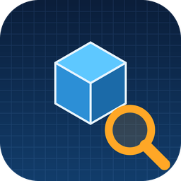
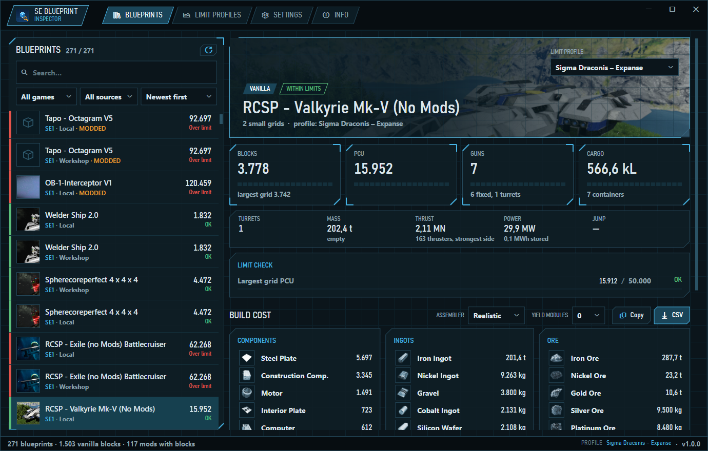
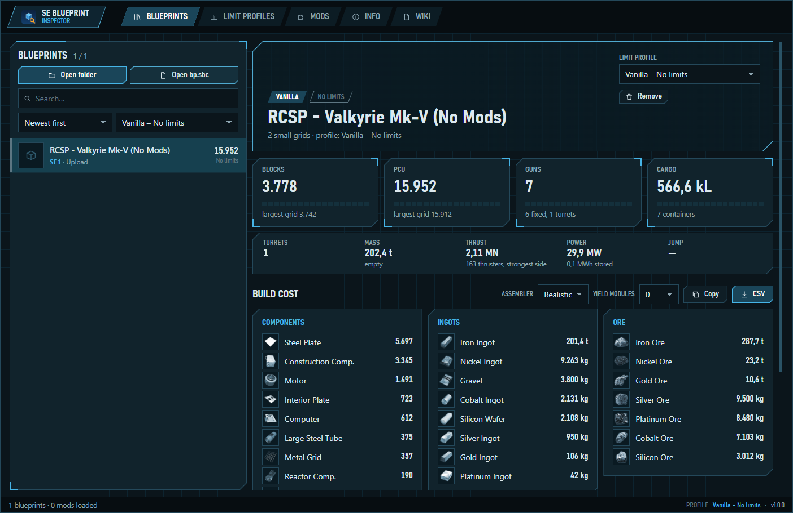
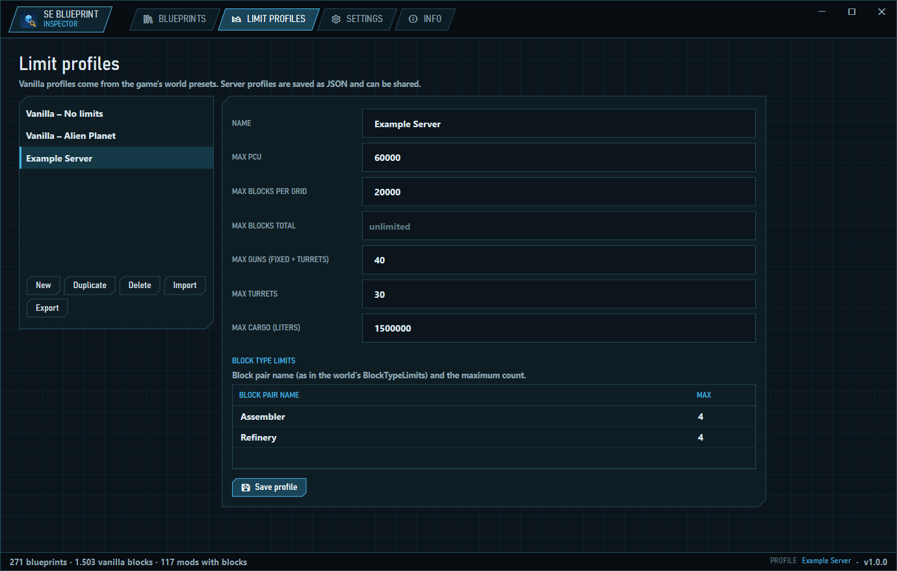

<div align="center">



# SE Blueprint Inspector

### Space Engineers blueprint viewer &amp; cost calculator

Blocks, PCU, guns, cargo and full build cost for every blueprint —<br>
checked against vanilla or server limits, with modded weapons and containers counted correctly.

<br>

[](https://github.com/Rathio12/SE_BlueprintEditor/releases/latest)
[](https://github.com/Rathio12/SE_BlueprintEditor/releases)
[](https://rathio12.github.io/SE_BlueprintEditor/)
[](https://github.com/Rathio12/SE_BlueprintEditor/actions/workflows/release.yml)


[](LICENSE)

**[Download](https://github.com/Rathio12/SE_BlueprintEditor/releases/latest)** &nbsp;·&nbsp;
**[Open in browser](https://rathio12.github.io/SE_BlueprintEditor/)** &nbsp;·&nbsp;
[Wiki](https://rathio12.github.io/SE_BlueprintEditor/wiki/Home.html) &nbsp;·&nbsp;
[Changelog](CHANGELOG.md) &nbsp;·&nbsp;
[Discussions](https://github.com/Rathio12/SE_BlueprintEditor/discussions) &nbsp;·&nbsp;
[Report a bug](https://github.com/Rathio12/SE_BlueprintEditor/issues/new/choose) &nbsp;·&nbsp;
[☕ Ko-fi](https://ko-fi.com/derechtealec)

<br>



</div>

<br>

## Made for engineers

| You are… | It helps you… |
|:--|:--|
| 🚀 **A player** | Know what a ship costs before you print it: every component, ingot and kilogram of ore, for realistic, x3 or x10 assemblers. |
| 🛰️ **On a server** | Check a blueprint against the server's PCU, block, gun, turret and cargo limits *before* you paste it and get it deleted. |
| 🛠️ **A server admin** | Write your limits once as a profile and share the JSON with your players, so everyone checks against the same rules. |
| 🔫 **Into weapon mods** | See WeaponCore / CoreSystems weapons counted as real guns and turrets, not as conveyor sorters. |
| 💻 **A scripter or modder** | Read how `.sbc` definitions, blueprints, recipes and WeaponCore scripts are parsed in the [wiki](https://rathio12.github.io/SE_BlueprintEditor/wiki/Home.html), and reuse the UI-free engine (`SEBlueprint.Core`, MIT or GPL). |

## Get it

| | Windows app | Website |
|:--|:--|:--|
| **Where** | [`SEBlueprintInspector.exe`](https://github.com/Rathio12/SE_BlueprintEditor/releases/latest) | [rathio12.github.io/SE_BlueprintEditor](https://rathio12.github.io/SE_BlueprintEditor/) |
| **Install** | None — one portable exe, no .NET needed | None — runs in the browser |
| **Blueprints** | Finds your whole library automatically | Open a blueprint folder or `bp.sbc` |
| **Mods** | Read from your Workshop folder | Add mod folders in the MODS tab |
| **Icons** | Real game icons from your install | The same game icons, built in |
| **Updates** | Opt-in: *Check now* or *Check on start* in Settings — installs in place, no re-download | Always the latest version |
| **Privacy** | Offline — only an update check you turn on talks to GitHub | Files are read locally, nothing is uploaded |

<details>
<summary><b>Website screenshot</b></summary>

<br>



</details>

> [!TIP]
> **Tried it?** Tell us how it went — [give feedback](https://github.com/Rathio12/SE_BlueprintEditor/issues/new?template=tester_feedback.yml) (takes a minute).

## Features

| | |
|:--|:--|
| **Counts what matters** | Blocks, PCU, mass, fixed guns, turrets, cargo containers and liters, thrust, power and jump range. |
| **Build cost** | Components → ingots → ore, assembler speed (realistic / x3 / x10) and refinery yield modules. Copy or export CSV. |
| **Limit checks** | **OK / NEAR / OVER** for the selected profile, with segmented gauges for PCU, blocks, guns and cargo. |
| **Honest about gaps** | Blocks from mods you don't have still count towards block limits; the blueprint is marked **INCOMPLETE** and the missing mods are listed with their Workshop IDs. |
| **Profiles** | Vanilla world presets, Sigma Draconis Expanse, Stone Industries, a typical modded server, or your own — shareable as JSON. |
| **Mods done right** | Per-mod blocks and recipes; WeaponCore / CoreSystems weapons recognised as guns or turrets. |

## Limit profiles



| Profile | What it is |
|:--|:--|
| **Vanilla – …** | Read from the world presets of your installed game. |
| **Sigma Draconis – Expanse** | The server's published limit: **50,000 PCU per grid**. |
| **Stone Industries (SI)** | 40,000 blocks per grid, no PCU limit; SI's per-player and per-grid block rules are listed in the profile. |
| **Modded server (typical)** | A starting point for modded survival servers — duplicate and adjust. |
| **Your own** | PCU, PCU per grid, blocks, guns, turrets, cargo and per-block-type limits — type numbers as you like (`50,000`, `50.000`, `50 000`). |

**OK** below 90 % of a limit · **NEAR** from 90 % to the limit · **OVER** above it · **INCOMPLETE** when blocks from missing mods could not be read.

## Space Engineers 2

> [!NOTE]
> **Full SE2 support is coming soon.** SE2 blueprints are listed with **blocks and PCU** and checked against
> PCU / block limits. Cost, weapons and cargo need the grid file, which uses an undocumented binary format.

## Privacy

> [!TIP]
> **Offline unless you ask.** No telemetry, no tracking, no native code. The only network access is the update check,
> which is **off by default** and only asks this repository's GitHub releases for the latest version. Updates are
> verified against GitHub's SHA-256 checksum before the exe is replaced. Game, mod and blueprint files are only read,
> never changed — and a test fails the build if network code appears anywhere else.
> Details in [PRIVACY.md](PRIVACY.md).

## Wiki

How game files, blueprints and mods are read and how every number is calculated —
**[on the website](https://rathio12.github.io/SE_BlueprintEditor/wiki/Home.html)** or in the **[GitHub wiki](https://github.com/Rathio12/SE_BlueprintEditor/wiki)** (source: [docs/wiki](docs/wiki/Home.md)).

<details>
<summary><b>Build from source</b></summary>

<br>

Requires Windows and the [.NET 8 SDK](https://dotnet.microsoft.com/download/dotnet/8.0) or newer.

```powershell
git clone https://github.com/Rathio12/SE_BlueprintEditor.git
cd SE_BlueprintEditor
dotnet test tests/SEBlueprint.Core.Tests                        # tests
dotnet run --project src/SEBlueprint.App                        # Windows app
dotnet publish src/SEBlueprint.App -c Release -o out/portable   # portable exe
./tools/publish-site.ps1                                        # website into docs/
```

`SEBlueprintInspector.exe <blueprint folder | bp.sbc>` opens that blueprint; `--page profiles|settings|info` picks the start tab.

| Folder | Content |
|:--|:--|
| `src/SEBlueprint.Core` | Game data, mods, blueprint analysis, cost and limits (no UI) |
| `src/SEBlueprint.App` | Windows app (WPF, custom UI) |
| `src/SEBlueprint.Web` | Website (Blazor WebAssembly, same Core) |
| `tests/` | xUnit tests with small fixture files |
| `tools/` | Release, changelog, website and data-export tools |
| `docs/` | GitHub Pages site, wiki and screenshots |

</details>

<details>
<summary><b>Versions and releases</b></summary>

<br>

Versions follow **`1.x.y`** — `x` is the build, `y` the fixes on that build.

```powershell
./tools/release.ps1          # next build:  1.1.0 -> 1.2.0
./tools/release.ps1 -Fix     # next fix:    1.2.0 -> 1.2.1
```

The script first runs the **release checklist** — README updated for new features, changelog has the changes,
tests pass, the solution builds with zero warnings and all document links work — then bumps the version in
[`Directory.Build.props`](Directory.Build.props) and pushes. GitHub Actions
([release.yml](.github/workflows/release.yml)) then updates [CHANGELOG.md](CHANGELOG.md) from
[Conventional Commits](https://www.conventionalcommits.org/), builds the exe, rebuilds the website and publishes the release.

</details>

## Contributing

Bug reports, mod-compatibility reports and pull requests are welcome —
see [CONTRIBUTING.md](CONTRIBUTING.md), [CODE_OF_CONDUCT.md](CODE_OF_CONDUCT.md) and [SECURITY.md](SECURITY.md).
Questions, ideas and **server profile presets** go to [Discussions](DISCUSSIONS.md).

## Support

The app is free and stays free. If it saves you time, **[buy me a coffee on Ko-fi](https://ko-fi.com/derechtealec)** ☕ —
or leave a ⭐, which helps other engineers find it.

[](https://ko-fi.com/derechtealec)

## License

Dual-licensed **MIT OR GPL-3.0-or-later** — pick whichever fits your project.
See [LICENSE](LICENSE), [LICENSE-MIT](LICENSE-MIT) and [LICENSE-GPL](LICENSE-GPL).

## Credits

- Inspired by [SE-BlueprintEditor](https://github.com/ScriptedEngineer/SE-BlueprintEditor) by ScriptedEngineer — independent rewrite, no code reused.
- [BCnEncoder.NET](https://github.com/Nominom/BCnEncoder.NET) (MIT) decodes the game icons.
- Sigma Draconis Expanse limits from [sigmadraconis.games](https://sigmadraconis.games/).
- Space Engineers, its data and icons © Keen Software House. Not affiliated with or endorsed by Keen Software House.
